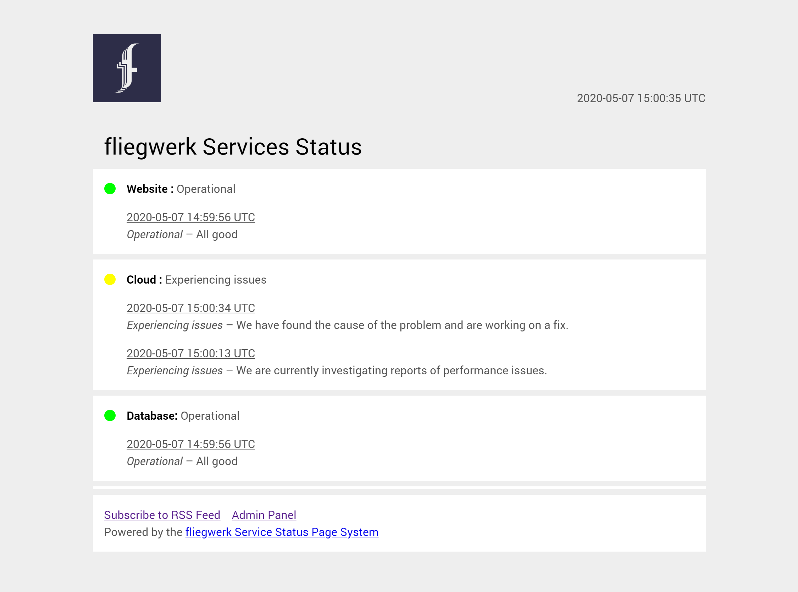

# fliegwerk Service Status Page System (fliegwerk SSPS)
An incredibly simple, low-dependency PHP and file-based status 
page system. No composer or anything else...

All you need to run it is:
- An Apache2 webspace
- PHP 7.2+

## Screenshots
### Frontend

### Backend

## Setup
Simply clone the repository and open the website where you're hosting the website.

For the following tutorial, we'll call this website https://status.example.com.

Upon first visit (as the `./app/data.json` file doesn't exist, 
yet), you will be guided through setting up the system.

Enter the services you wish to list on the page (one service per line), 
an admin password and click setup.

The setup shouldn't take more than a few seconds, and after that, 
you're good to go.

After that, you can adjust the configuration (page title, font, etc.) by
editing the values in the `config.php`.

After that, you're already good to go.

## How it works
### Services
Services (which are defined in the `./app/data.json` file) are
the services whose status you want to display on the status page.
### States
The `./app/data.json` file defines the different states a service can be in. By default, these are:

| State name | Color |
| --- | --- |
| Operational | Green |
| Upcoming maintenance | Blue |
| Under maintenance | Red |
| Experiencing issues | Orange |
| Down | Red |

What you'll work with in production, however, are entries.

### Entries
Entries are similar to blog posts. They contain the entry's date and time, a message, new state 
and affected services.

**The latest entry's state affecting a service defines the service's current state.**

## Adding entries
You can easily submit new entries via the admin panel. Entries will automatically receive the date and time of when 
they were submitted.

### Procedure
1. Open `https://status.example.com/admin.php`
2. Log in with the admin password defined in the setup
3. Select the entry's new state
4. Select the affected services
   > NOTE: You can also select multiple services, here.
5. Write a message containing the details of the status update.
   
   Examples:
   > A maintenance has been scheduled for 20:00 UTC. Systems will be unavailable for approximately 15 minutes.
   
   > The system is operational again

   > We have received reports about performance issues and are currently investigating.
6. Click *Save*

The entry gets saved 

## Attribution
Developed by [Pablo Klaschka](https://github.com/pklaschka).